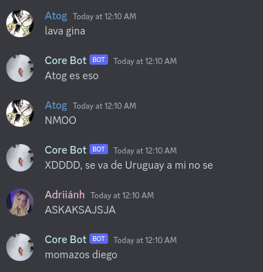

# corebot
[](license.txt)
[](https://discord.gg/xbba2fy)

A Discord bot that says random things **based** on previous messages in the same channel
it speaks on, often funny

This bot program is made to be self-hosted by anyone, **it doesn't have an official
Discord Bot**


## What does it do?

This bot creates random sentences using previous messages in the same channel

<details>
<summary>Examples (Spanish)</summary>

*(~2 hours of 'training' it by just chatting in its channel)*




</details>


## Running

### Requirements
- Git
- Node.js & NPM

### Steps
- Clone the repository using `git clone https://github.com/yusshu/corebot`
- Open the created `corebot` folder
- Create a `.env` file using the `.env.example` template and fill it with your information
- Create `data/status.json` and `data/words.json` *(I'm too lazy to make this not required)*

```json
// status.json file should look like this:
{
  "collect": true,
  "talk": false
}

// words.json file should look like this:
[]
```
- Run `npm install` to install the dependencies
- Finally run `npm start` and let it be


## Known Issues
*(The codebase is really old and requires some changes, I just revived it making a few modifications)*
- The `data/words.json` file gets really big in a short amount of time